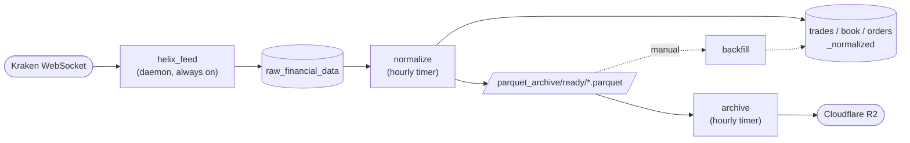

# HelixFeed Documentation

The reference set for HelixFeed: what every piece is, what it depends on, what depends on
it, and what to touch when you want to change something. Everything here was written by
reading the source, and describes the code as of the `fix/critical-data-loss` branch
(2026-10-06). If code and docs disagree, the code wins — fix the doc in the same commit.

## Where to start

You don't need to read all of this. Pick by what you're doing:

| I want to… | Read |
|---|---|
| Get the big picture in 5 minutes | [architecture.md](architecture.md) |
| Follow one message from Kraken all the way to R2 | [data-lifecycle.md](data-lifecycle.md) |
| Know what a specific file does and who calls it | [modules.md](modules.md) |
| Understand the tasks, channels, locks, and what happens when something fails | [runtime.md](runtime.md) |
| Change a value in `helix_config.yml` or `.env` | [configuration.md](configuration.md) |
| Touch a table, a column, or a migration | [database.md](database.md) |
| Deploy, restart, or debug on the quant server | [operations.md](operations.md) |
| **Make a change by hand** (add a symbol, feed type, provider, column, metric…) | [change-guide.md](change-guide.md) |
| Run or write tests | [testing.md](testing.md) |
| Find out what a log line means | [logging.md](logging.md) |
| See where the project is going | [roadmap.md](roadmap.md), [provider-pattern.md](provider-pattern.md) |

## The one-paragraph version

HelixFeed is **four separate programs** that share one library crate. The **daemon**
(`helix_feed`) holds WebSocket connections to Kraken and writes every raw JSON message into
the Postgres table `raw_financial_data`. Once an hour, the **normalizer** (`normalize`)
moves those raw rows out: it snapshots them to a Parquet file, parses them into typed
`*_normalized` tables, then deletes them from the raw table. Also hourly, the **archiver**
(`archive`) uploads those Parquet files to Cloudflare R2 and deletes the local copy.
**Backfill** (`backfill`) is a manual recovery tool that rebuilds normalized tables from
Parquet files. Each program is its own process on purpose: a crash in one can never take
down live data collection.

## Glossary

| Term | Meaning in this codebase |
|---|---|
| **Provider** | A data source (exchange). Only `kraken` is implemented. Configured under `providers:`. |
| **Feed type** | `trades`, `book` (L2 order book), or `orders` (L3 order-by-order book). Enum `FeedType` in `config/mod.rs`. |
| **Symbol feed / pipeline** | One `(provider, symbol, feed_type)` combination, e.g. Kraken · BTC/USD · book. Each one gets its own WebSocket task, channel, buffer, and inserter task. |
| **Raw row** | One WebSocket text message, stored unmodified as JSONB in `raw_financial_data`. |
| **Swap** | When a `DoubleBuffer`'s active side reaches `buffer_capacity × buffer_swap_trigger` messages and gets handed to the DB writer. |
| **Flush** | Writing a partially filled buffer: every 5 s, on shutdown, or when the feed closes. |
| **Normalized row** | A parsed, typed version of a raw row (one raw message can become several normalized rows). |
| **Staging / ready / failed / corrupt** | The four `parquet_archive/` folders a Parquet file moves through. See [data-lifecycle.md](data-lifecycle.md#stage-6--parquet-file-lifecycle). |
| **Sidecar** | `failed/<name>.attempts`, a text file holding how many times that Parquet upload has failed. |
| **Stale connection** | A WebSocket that sent no frame at all for 60 s. Treated as dead and reconnected. |

## Conventions used in these docs

- File references are relative to the repo root and clickable, e.g.
  [src/db/inserter.rs](../src/db/inserter.rs).
- ⚠️ marks a known gap or sharp edge. These are real behaviours of the current code,
  not plans.
- "Dead code" means it compiles but nothing calls it. It's listed in
  [modules.md](modules.md#dead--unused-code) so you don't waste time tracing it.
