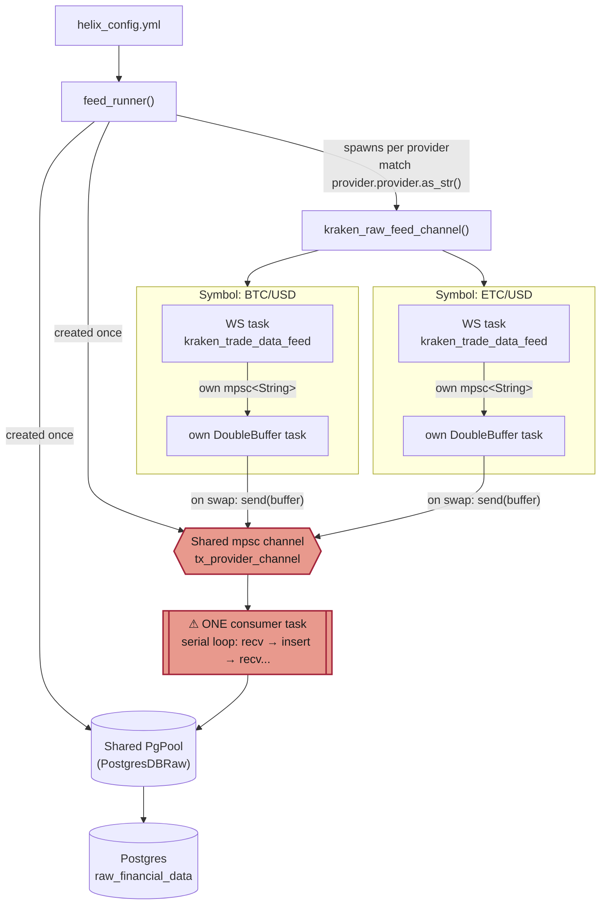
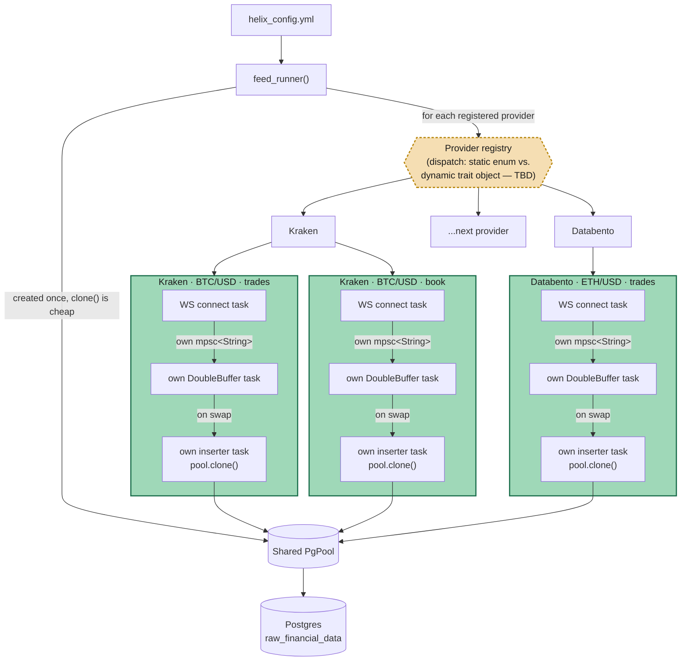

# HelixFeed Architecture

This is the reference map for the current refactor: fixing the shared-DB bottleneck and making providers pluggable, designed as one shape rather than two separate changes.

## Current State (post-cleanup, pre-refactor)

Per-symbol WebSocket ingestion and buffering are already independent. The break happens at the DB hand-off: every symbol, across every provider, funnels into **one shared channel** drained by **one shared task**, inserted into Postgres **one buffer at a time, in receipt order**.

**The problem this causes:** the shared channel is bounded (`buffer_capacity` slots). If the single inserter task is slow — or one symbol is dumping messages fast enough to fill the channel — `send(buffer).await` blocks for *every* symbol trying to flush, not just the busy one. No data gets mixed up (every row carries its own provider/symbol/feed_type tag), but throughput for an unrelated, healthy symbol can stall behind a slow or broken one. That's the head-of-line blocking we're removing.

## Target State (independent per-symbol pipeline, pluggable providers)

Each symbol, on each provider, owns its pipeline end to end — including its own database write. The only thing shared across all of them is the connection **pool** (cheap to clone, meant to be shared), never a channel or a task. A provider registry sits above everything so adding an exchange means implementing one interface and registering it — not editing `feed_runner`'s dispatch logic. (Whether that registry is a static enum or dynamic trait objects is still open — see `docs/provider-pattern.md`.)

A symbol dying, reconnecting, or backing up can only ever block *itself*. Postgres still sees bounded concurrency (the pool enforces that), but that's real backpressure on a shared resource, not artificial backpressure from a shared queue.

## Current vs. Target, at a glance

| | Current | Target |
|---|---|---|
| Per-symbol WS + buffer | ✅ already independent | ✅ unchanged |
| Path to Postgres | ❌ one shared channel, one shared task | ✅ own channel, own task per symbol |
| Postgres connections | pool exists but only 1 task ever uses it | pool shared, used concurrently by every symbol's task |
| Adding a provider | edit `feed_runner`'s string match + write a parallel `<provider>_raw_feed_channel` fn | implement one trait/interface, register it |
| Blast radius of a slow/broken symbol | can stall unrelated symbols' DB writes | contained to itself |

## Open question

Static dispatch (enum + trait) vs. dynamic dispatch (trait objects via `async-trait`) for the provider registry — to be resolved in `docs/provider-pattern.md` with both sketched out before choosing.
