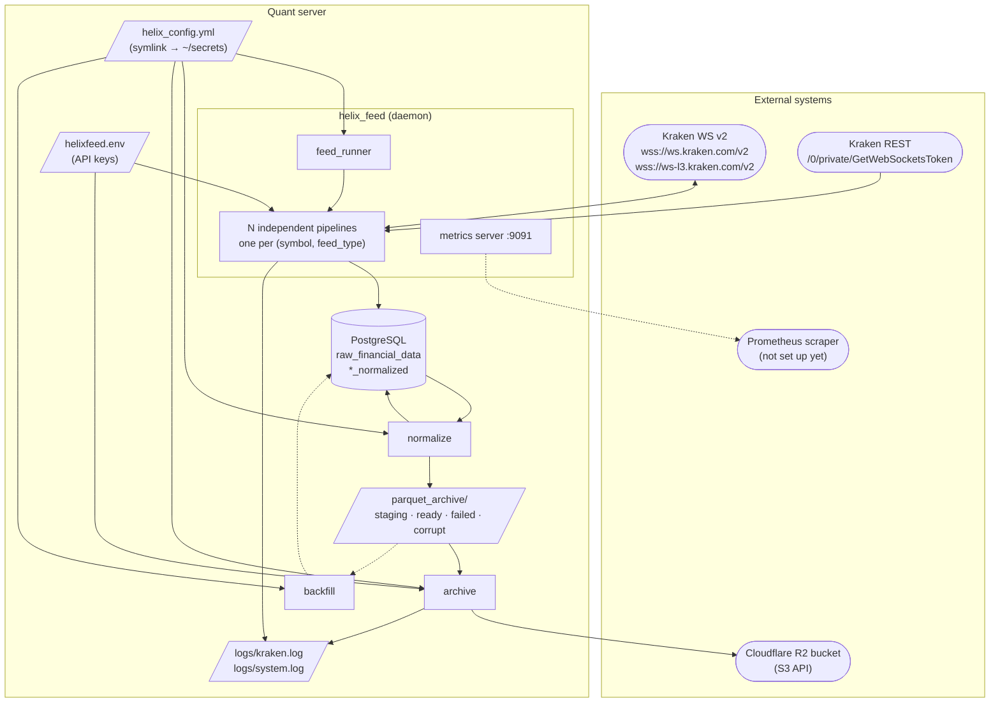
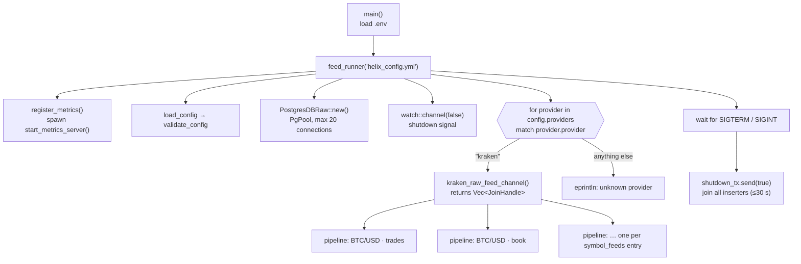
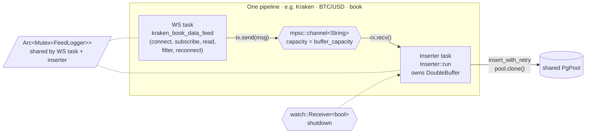
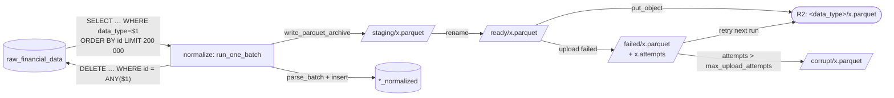

# HelixFeed Architecture

The big picture: which processes exist, which outside systems they talk to, and how one
symbol's pipeline is shaped inside the daemon. For per-file detail see
[modules.md](modules.md); for the exact data path see [data-lifecycle.md](data-lifecycle.md).

> **History:** an earlier version of this file described the *pre-M3* design, where every
> symbol funneled into one shared channel and one serial inserter task. That bottleneck is
> gone. Every symbol now owns its whole pipeline, including its own DB writer, and the
> only shared object is the Postgres connection pool. See [roadmap.md](roadmap.md) M3.

## 1. Processes and external systems

One Cargo package (`helix_feed`) builds **one library** (`src/lib.rs`) plus **four
binaries**. All four read the same `helix_config.yml` from their **current working
directory**.

| Binary | Source | Runs as | Lifetime | Job |
|---|---|---|---|---|
| `helix_feed` | [src/main.rs](../src/main.rs) | `helixfeed.service` | Always on, restarts on failure | WebSocket → Postgres raw table |
| `normalize` | [src/bin/normalize.rs](../src/bin/normalize.rs) | `helixfeed-normalize.timer` (hourly) | Oneshot | Raw table → Parquet + normalized tables, then deletes the raw rows |
| `archive` | [src/bin/archive.rs](../src/bin/archive.rs) | `helixfeed-archive.timer` (hourly) | Oneshot | Parquet files → Cloudflare R2 |
| `backfill` | [src/bin/backfill.rs](../src/bin/backfill.rs) | Manual: `backfill <trades\|book\|orders>` | Oneshot | Parquet in `staging/` → normalized tables (recovery) |

```mermaid
flowchart TB
    subgraph EXT["External systems"]
        KWS(["Kraken WS v2<br/>wss://ws.kraken.com/v2<br/>wss://ws-l3.kraken.com/v2"])
        KREST(["Kraken REST<br/>/0/private/GetWebSocketsToken"])
        R2(["Cloudflare R2 bucket<br/>(S3 API)"])
        PROM(["Prometheus scraper<br/>(not set up yet)"])
    end

    subgraph HOST["Quant server"]
        CFG[/"helix_config.yml<br/>(symlink → ~/secrets)"/]
        ENV[/"helixfeed.env<br/>(API keys)"/]

        subgraph DAEMON["helix_feed (daemon)"]
            FR["feed_runner"]
            PIPE["N independent pipelines<br/>one per (symbol, feed_type)"]
            MET["metrics server :9091"]
        end

        NORM["normalize"]
        ARCH["archive"]
        BACK["backfill"]

        PG[("PostgreSQL<br/>raw_financial_data<br/>*_normalized")]
        DISK[/"parquet_archive/<br/>staging · ready · failed · corrupt"/]
        LOGS[/"logs/kraken.log<br/>logs/system.log"/]
    end

    CFG --> FR & NORM & ARCH & BACK
    ENV --> PIPE & ARCH
    KWS <--> PIPE
    KREST --> PIPE
    PIPE --> PG
    PIPE --> LOGS
    FR --> PIPE
    MET -.-> PROM
    PG --> NORM --> PG
    NORM --> DISK
    DISK --> ARCH --> R2
    ARCH --> LOGS
    DISK -.-> BACK -.-> PG
```

**Why separate processes:** the daemon is the only piece that can lose data if it's down
(Kraken doesn't replay). Keeping normalization and archiving in other processes means a
panic, an OOM, or a bad deploy of those jobs can't stop collection. The raw table acts as
the hand-off queue between them.

## 2. Inside the daemon

`feed_runner` does setup, then waits for a shutdown signal. All real work happens in
spawned Tokio tasks.

```mermaid
flowchart TD
    MAIN["main()<br/>load .env"] --> FR["feed_runner('helix_config.yml')"]
    FR --> M1["register_metrics()<br/>spawn start_metrics_server()"]
    FR --> M2["load_config → validate_config"]
    FR --> M3["PostgresDBRaw::new()<br/>PgPool, max 20 connections"]
    FR --> M4["watch::channel(false)<br/>shutdown signal"]
    FR --> LOOP{{"for provider in config.providers<br/>match provider.provider"}}
    LOOP -->|"&quot;kraken&quot;"| KRF["kraken_raw_feed_channel()<br/>returns Vec&lt;JoinHandle&gt;"]
    LOOP -->|"anything else"| UNK["eprintln: unknown provider"]
    KRF --> P1["pipeline: BTC/USD · trades"]
    KRF --> P2["pipeline: BTC/USD · book"]
    KRF --> P3["pipeline: … one per symbol_feeds entry"]
    FR --> WAIT["wait for SIGTERM / SIGINT"]
    WAIT --> SD["shutdown_tx.send(true)<br/>join all inserters (≤30 s)"]
```

### The shape of one pipeline

`kraken_raw_feed_channel` loops over `symbol_feeds` and, for each entry, builds this:

```mermaid
flowchart LR
    subgraph PIPE["One pipeline · e.g. Kraken · BTC/USD · book"]
        direction LR
        WS["WS task<br/>kraken_book_data_feed<br/>(connect, subscribe, read,<br/>filter, reconnect)"]
        CH{{"mpsc::channel&lt;String&gt;<br/>capacity = buffer_capacity"}}
        INS["Inserter task<br/>Inserter::run<br/>owns DoubleBuffer"]
        WS -->|"tx.send(msg)"| CH -->|"rx.recv()"| INS
    end
    INS -->|"insert_with_retry<br/>pool.clone()"| POOL[("shared PgPool")]
    FL[/"Arc&lt;Mutex&lt;FeedLogger&gt;&gt;<br/>shared by WS task + inserter"/] -.- WS
    FL -.- INS
    SHUT{{"watch::Receiver&lt;bool&gt;<br/>shutdown"}} -.-> INS
```

What each pipeline owns, and what it shares:

| Owned by one pipeline | Shared across all pipelines |
|---|---|
| WebSocket connection + reconnect counter | `PgPool` (cloned handle; an `Arc` inside) |
| `mpsc` channel | Shutdown `watch` channel |
| `DoubleBuffer` | The log files on disk (each pipeline has its *own* `FeedLogger`/`SysLogger` handle to the same file) |
| `FeedLogger` handle, `SysLogger` handle | Prometheus `REGISTRY` (static) |
| | Kraken token-fetch lock + nonce (static, `connector.rs`, Orders only) |

**Consequence:** a pipeline that is slow, reconnecting, or dead can only stall *itself*.
The one shared choke point is the pool: with 20 connections and fewer than 20 pipelines,
nobody waits.

## 3. The batch side

```mermaid
flowchart LR
    RAW[("raw_financial_data")] -->|"SELECT … WHERE data_type=$1<br/>ORDER BY id LIMIT 200 000"| NB["normalize: run_one_batch"]
    NB -->|"write_parquet_archive"| ST[/"staging/x.parquet"/] -->|"rename"| RD[/"ready/x.parquet"/]
    NB -->|"parse_batch + insert"| NT[("*_normalized")]
    NB -->|"DELETE … WHERE id = ANY($1)"| RAW
    RD -->|"put_object"| R2(["R2: &lt;data_type&gt;/x.parquet"])
    RD -->|"upload failed"| FA[/"failed/x.parquet<br/>+ x.attempts"/]
    FA -->|"retry next run"| R2
    FA -->|"attempts &gt; max_upload_attempts"| CO[/"corrupt/x.parquet"/]
```

Full step-by-step, including where data can be duplicated or lost, is in
[data-lifecycle.md](data-lifecycle.md).

## 4. Design decisions worth knowing

| Decision | Why | Where |
|---|---|---|
| Store **raw JSON first**, normalize later | Kraken's payload can change or be misparsed. Raw is the source of truth you can always re-derive from. | `raw_financial_data`, Parquet archive |
| **One unified raw table** with a `data_type` column (not per-feed tables) | One batched `UNNEST` insert path for everything. Migration `20260726…` dropped the old per-feed tables. | [database.md](database.md) |
| **One pipeline per (symbol, feed_type)**, one symbol per WS subscription | Isolation: one bad feed can't block another. Costs one TCP connection each. | `raw_feed.rs` |
| **Batch writes** via buffer swap + `UNNEST` | Per-message inserts couldn't keep up with book/L3 rates. | `buffer.rs`, `postgresql.rs` |
| **Bounded channel** (`buffer_capacity` slots) | Backpressure: if the inserter falls behind, the WS task blocks on `send` instead of eating RAM. | `raw_feed.rs` |
| **Retry, then drop** a failed batch (never stop the inserter) | One bad batch or a DB blip must not end collection. | `inserter.rs` |
| **Dynamic dispatch** chosen for future providers | Providers get added opportunistically. Not built yet (M4). | [provider-pattern.md](provider-pattern.md) |

## 5. Known structural gaps

- ⚠️ **No provider abstraction yet.** `feed_runner` string-matches `"kraken"`, and the
  traits in `data_feeds/traits.rs` aren't used. Adding a provider means a parallel
  `<provider>_raw_feed_channel` function. See [change-guide.md](change-guide.md#add-a-new-provider).
- ⚠️ **Metrics are registered but never updated.** `:9091/metrics` always reports zeros.
- ⚠️ **Book/L3 normalization drops the `type` field** (`snapshot` vs `update`), so you
  can't rebuild the book from `book_normalized` alone. The raw Parquet still has it.
- ⚠️ **`received` is per batch, not per message.** It's set when the buffer is converted,
  not when the message arrived.
