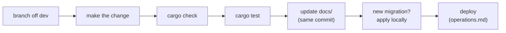
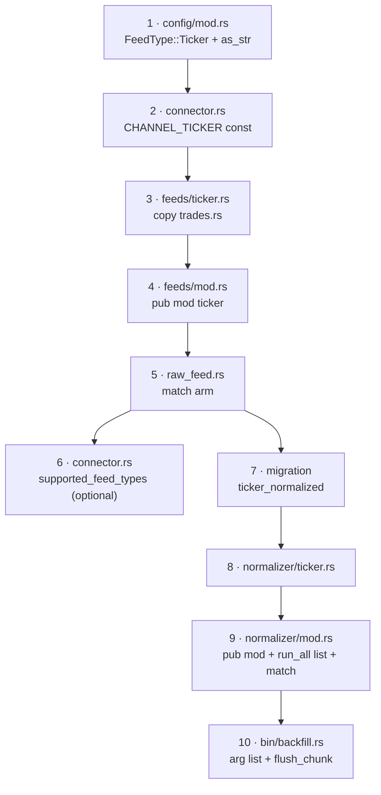

# Change Guide

Recipes for the changes you're most likely to make by hand. Each one lists **every place
that has to change together**, in the order to do them, plus how to check it worked. If
your change isn't here, use the [ripple matrix](#ripple-matrix-if-you-change-x-check-y)
at the bottom and [modules.md](modules.md) "Used by".

## General workflow



- `cargo check` after every step. The compiler is your checklist for anything typed:
  enums, structs, function signatures.
- **SQL strings and string constants aren't checked by the compiler.** Those are the ones
  the recipes below call out explicitly.

---

## 1. Add or remove a symbol

**Config only, no code.**

1. Add an entry to `symbol_feeds` in `helix_config.yml` (one entry per feed type you want):
   ```yaml
   - { markets: crypto, symbol: "ETH/USD", feed_type: trades }
   ```
2. Restart the daemon: `sudo systemctl restart helixfeed`.
3. Check: `grep "ETH/USD" logs/kraken.log` shows "Engine Starting", then "Connected", then
   "Buffer swap triggered".

Use Kraken **v2** symbol names (`BTC/USD`, not `XBTUSD`). A wrong symbol shows up as a
"No messages received in 60s" reconnect loop.

## 2. Tune batching / buffering

| Goal | Change |
|---|---|
| Fewer, bigger DB writes | raise `buffer_capacity` (config) |
| Write sooner after each message | lower `buffer_swap_trigger` (config) or `FLUSH_INTERVAL` ([raw_feed.rs](../src/data_feeds/kraken/raw_feed.rs)) |
| More patience during a DB outage | `RetryPolicy::default()` in [inserter.rs](../src/db/inserter.rs) |
| More/less tolerance for quiet feeds | `STALE_CONNECTION_TIMEOUT_SECS` in [connector.rs](../src/data_feeds/kraken/connection/connector.rs) |

Remember that `buffer_capacity` also sizes the channel (backpressure).

## 3. Add a new Kraken feed type (e.g. `ticker`)

This is the biggest common change. It touches the daemon, the DB, and the batch side.



1. **[config/mod.rs](../src/config/mod.rs):** add `Ticker` to `FeedType` and `"ticker"`
   to `as_str()`. With `#[serde(rename_all = "lowercase")]`, YAML `feed_type: ticker` now
   parses. `cargo check` will flag every non-exhaustive `match`.
2. **[connector.rs](../src/data_feeds/kraken/connection/connector.rs):** `pub const CHANNEL_TICKER: &str = "ticker";`
3. **`src/data_feeds/kraken/feeds/ticker.rs`:** copy `trades.rs`. Rename the request
   structs and functions (`kraken_ticker_data_feed`, `run_ticker_feed`). Set the
   subscribe `channel` and the filter (`channel == CHANNEL_TICKER`). Keep the
   **`return` on a failed `tx.send`**. Copy the tests and adapt the message JSON.
4. **[feeds/mod.rs](../src/data_feeds/kraken/feeds/mod.rs):** `pub mod ticker;`
5. **[raw_feed.rs](../src/data_feeds/kraken/raw_feed.rs):** import the function and add a
   `FeedType::Ticker => { … tokio::spawn(kraken_ticker_data_feed(…)) }` arm, shaped like the others.
   At this point the daemon **collects** ticker data into `raw_financial_data` with
   `data_type = 'ticker'`.
6. *(optional)* add it to `KrakenConnector::supported_feed_types`.
7. **Migration** `migrations/<ts>_create_ticker_normalized.sql` with the columns you want,
   plus the `(symbol, provider, event_time)` index. Use `BIGSERIAL` for `id`. Apply it.
8. **`src/normalizer/ticker.rs`:** copy `trades.rs`. Write the `Raw*` serde structs from a
   real message (grab one: `SELECT raw_json FROM raw_financial_data WHERE data_type='ticker' LIMIT 1`),
   then `parse_batch` and `insert`.
9. **[normalizer/mod.rs](../src/normalizer/mod.rs):** `pub mod ticker;`, add `"ticker"` to
   the array in `run_all`, and an arm in `run_one_batch`'s `match`.
   ⚠️ **If you skip this step, ticker rows pile up in the raw table forever.** Nothing
   errors. The normalizer just never asks for them.
10. **[bin/backfill.rs](../src/bin/backfill.rs):** add `"ticker"` to the allowed list and to
    `flush_chunk`.
11. Docs: the feed tables in [data-lifecycle.md](data-lifecycle.md), [database.md](database.md),
    and [configuration.md](configuration.md).

**Verify:** `cargo test`, then run locally against the real Kraken feed, check rows in
`raw_financial_data`, run `cargo run --bin normalize`, and check rows in
`ticker_normalized` and a new file in `parquet_archive/ready/`.

## 4. Add a new provider (current architecture, pre-M4)

Until the provider registry exists ([roadmap.md](roadmap.md) M4), a provider is a parallel
copy of the Kraken module.

1. **[config/mod.rs](../src/config/mod.rs):** add the name to `known_providers` in
   `validate_config`.
2. **`src/data_feeds/<provider>/`:** mirror the `kraken/` layout: `connection/`
   (URLs, connect, auth), `feeds/*.rs` (one WS loop per feed type, same contract: send
   raw `String`s on `tx`, `return` when `send` fails, reconnect on everything else),
   and `raw_feed.rs` with `<provider>_raw_feed_channel(…, shutdown) -> Result<Vec<JoinHandle<()>>>`
   that builds an `Inserter` per pipeline exactly like Kraken's.
3. **[data_feeds/mod.rs](../src/data_feeds/mod.rs):** `pub mod <provider>;`
4. **[feed_runner.rs](../src/runners/feed_runner.rs):** add a `"<provider>" => …` arm next
   to `"kraken"` and push its handles into `inserters`. **If you miss the handles,
   shutdown won't flush that provider.**
5. **Normalizer:** `data_provider` is already a column, but `normalizer/<type>.rs`
   deserializes **Kraken's** JSON shape. A provider with a different payload needs its
   own parse path. The simplest version: branch on `record.data_provider` inside each
   `parse_batch`.
6. New secrets → add the env vars to `~/secrets/helixfeed.env` and to
   [configuration.md](configuration.md#environment-variables).

The reusable pieces (no changes needed): `Inserter`, `DoubleBuffer`, `PostgresDBRaw`,
the loggers, the whole batch side (except parsing).

## 5. Add a column to a normalized table (e.g. `market`)

1. Migration: `ALTER TABLE trades_normalized ADD COLUMN market TEXT;` (nullable, or with a
   `DEFAULT`, so existing rows stay valid).
2. `Normalized*` struct: add the field.
3. `parse_batch`: fill it in. If it comes from config (like `market`), it has to reach the
   **raw** row first, because the normalizer never reads `helix_config.yml` for this. That
   makes it recipe 6 as well.
4. `insert`: add a `Vec`, a `$n::type[]` in `UNNEST`, a column name, and a `.bind()`.
   **Keep all three lists in the same order.** The compiler doesn't check this, and a
   mismatch puts data in the wrong column silently.
5. Re-run the relevant tests (the postgres test checks column alignment for raw; write a
   similar one for your table).

## 6. Add a column to `raw_financial_data`

Everything that reads or writes raw rows changes together:

1. Migration (nullable or with a default).
2. [postgresql.rs](../src/db/postgresql.rs): `RawRow` field, `data_buff_to_rawrows`,
   `insert_raw_data_batch` (vector + UNNEST + bind), and the test.
3. If the value comes from config: thread it through `raw_feed.rs` → `Inserter` →
   `DataBuffer` (setters/getters in [buffer.rs](../src/db/buffer.rs)).
4. [normalizer/mod.rs](../src/normalizer/mod.rs): `RawRecord`, `fetch_unprocessed`
   (SELECT + mapping), and `write_parquet_archive` if it belongs in the archive (append
   it as the **last** column).
5. [backfill.rs](../src/bin/backfill.rs): read the new index. Old Parquet files won't have
   the column, so handle that the way `read_archive_id` handles INT32 vs INT64.

## 7. Wire up a Prometheus metric

All five metrics exist in [prometheus.rs](../src/metrics/prometheus.rs), and every call
site is marked `TODO(v1.1.0 metrics)`. Find them with:

```bash
grep -rn "TODO(v1.1.0 metrics)" src
```

The pattern at a call site:

```rust
use crate::metrics::prometheus::TOTAL_MESSAGES;
TOTAL_MESSAGES
    .with_label_values(&["kraken", log_ctx.symbol.as_str(), log_ctx.feed_type.as_str()])
    .inc();
```

The feed functions don't receive the provider name today, which is why `"kraken"` is
hard-coded above. That's fine inside the Kraken module; pass it in if you want it generic. A new metric means: define it in the `lazy_static!`
block, then register it in `register_metrics()`. Check with `curl localhost:9091/metrics`.
Batch jobs (normalize/archive) exit before any scrape, so they need a Pushgateway instead.

## 8. Change where Parquet files go

The folder strings are **defined twice**: `normalizer/mod.rs` (`STAGE`, `READY`) and
`archive/r2.rs` (`READY`, `FAILD`, `CORRUPT`). Change both `READY`s together. Ideally,
move them into one shared module (e.g. `src/archive/paths.rs`) so this can't drift.

## 9. Change the Parquet schema

`write_parquet_archive` defines it. `backfill` reads it **by column index**, and old files
in R2 keep the old schema forever. Rules: only **append** columns, never reorder, and make
`backfill` tolerate the missing column on old files.

## 10. Add a log line

Pick the logger by scope (see [logging.md](logging.md)):
- About one pipeline → `FeedLogger`. Lock it in a `{ }` block and **never** hold the guard
  across `.await`.
- About the system → `SysLogger`.

Levels: `Info` = expected lifecycle, `Warn` = abnormal but recovered, `Error` = something
stopped or data was dropped. Don't log per message (that was removed for good reason).

## 11. Change a hard-coded timing or size

See the table in [configuration.md](configuration.md#hard-coded-values-you-might-want-to-tune).
To make one configurable: add the field to the config struct with
`#[serde(default = "…")]` so existing config files keep working. Validate it in
`validate_config`, then thread it to where the constant is used.

---

## Ripple matrix: if you change X, check Y

| You change… | Also check |
|---|---|
| `FeedType` variants / `as_str()` | `raw_feed.rs` match, normalizer `run_all` + `run_one_batch`, `backfill` arg list, existing `data_type` values in the DB |
| Any config struct field | `validate_config`, the tests' `valid_config()`, `helix_config.example.yml`, the real `~/secrets/helix_config.yml`, configuration.md |
| `kraken_*_data_feed` signature | `raw_feed.rs` call site, that file's tests |
| `Inserter` fields | `raw_feed.rs` construction, `inserter.rs` test helper `inserter()` |
| `RawRow` | `insert_raw_data_batch`, `data_buff_to_rawrows`, `FakeSink`, postgres tests |
| `DataBuffer` / `DoubleBuffer` API | `inserter.rs`, `postgresql.rs::data_buff_to_rawrows` |
| Raw table columns | daemon insert **and** normalizer fetch, both binaries deployed together |
| Normalized table columns | that `normalizer/<type>.rs::insert` (column list, UNNEST types, binds) |
| Kraken message format | normalizer `Raw*` structs (feeds store raw, so collection keeps working) |
| Parquet filename format | archiver `get_file_prefix` (R2 folder), backfill prefix filter |
| Parquet columns | backfill indexes |
| Log file paths | the directory must exist; logrotate config |
| Env var names | `~/secrets/helixfeed.env`, `.env`, configuration.md |
| Metrics address / port | firewall, Prometheus scrape config |
| A migration | apply it before deploying; never edit an applied one |
| systemd unit templates in `deploy/` | the **installed** copies in `/etc/systemd/system/` + `daemon-reload` (CI doesn't install them) |
