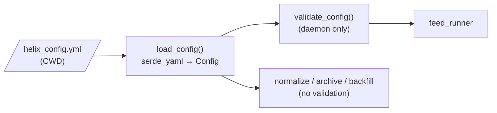

# Configuration

HelixFeed has two configuration inputs:

1. **`helix_config.yml`**: structure (providers, symbols, DB, paths, buffer). Git-ignored.
   Template: [helix_config.example.yml](../helix_config.example.yml).
2. **Environment variables**: secrets (API keys). From `.env` locally (loaded by
   `dotenvy`), or the systemd `EnvironmentFile=` on the server.

Both are read relative to / at the time of process start, by **every binary separately**.
Changing config needs a **daemon restart**. The batch jobs pick it up on their next run.

## How config is loaded



- An unknown YAML **key** is ignored silently (no `deny_unknown_fields`). A typo in an
  optional key means the default gets used.
- A missing **required** key, or a wrong type, makes `load_config` fail with a serde error.
- ⚠️ Only the daemon calls `validate_config`. The batch jobs trust the file as-is.

## `helix_config.yml` field reference

### Top level

| Field | Type | Required | Validated | Used by | Effect |
|---|---|---|---|---|---|
| `providers` | list | yes | each entry (below) | daemon | one setup per entry |
| `database_conf` | map | yes | see below | all binaries | |
| `log_config` | map | yes | non-empty paths | daemon, archive | |
| `buffer_capacity` | usize | yes | `> 0` | daemon | **two things:** the swap size base *and* the `mpsc` channel capacity, per pipeline |
| `buffer_swap_trigger` | f32 | yes | `0.0 ≤ x ≤ 1.0` | daemon | swap at `floor(capacity × trigger)` messages |

Worked example: `buffer_capacity: 100`, `buffer_swap_trigger: 0.8` → a DB write every 80
messages (or every 5 s, whichever comes first), and up to 100 messages queued between the
WS task and the inserter.
⚠️ `buffer_swap_trigger: 0.0` passes validation but makes **every single message** its
own insert.

### `providers[]`

| Field | Type | Validated | Used in | Effect |
|---|---|---|---|---|
| `provider` | string | must be `kraken` or `databento` | `feed_runner` match | ⚠️ `databento` passes validation but only prints "Unknown provider" at runtime |
| `reconnect_delay_secs` | u32 | — | feed tasks | sleep between **failed** connects (not after a drop) |
| `max_reconnect_attempts` | u32 | `> 0` | feed tasks | consecutive failed connects (or token fetches) before the pipeline stops for good |
| `symbol_feeds` | list | each `symbol` non-empty | `raw_feed.rs` | **one pipeline per entry** |

### `providers[].symbol_feeds[]`

| Field | Type | Values | Effect |
|---|---|---|---|
| `markets` | enum | `crypto` \| `futures` \| `forex` \| `equities` | parsed, **not used** anywhere yet |
| `symbol` | string | Kraken v2 format, e.g. `BTC/USD` | subscription symbol; stored in `raw_financial_data.symbol` |
| `feed_type` | enum | `trades` \| `book` \| `orders` | which WS function runs; stored as `data_type` |

To collect trades + book + orders for one symbol you need **three entries**, which means
three pipelines and three WebSocket connections.

### `database_conf.postgres_config`

| Field | Type | Validated | Notes |
|---|---|---|---|
| `host` | string | non-empty | |
| `port` | **string** | parses as u16 | quoted in YAML, e.g. `"5433"` |
| `database` | string | — | |
| `user` / `password` | string | non-empty | ⚠️ inserted into a `postgres://` URL without escaping, so avoid `@ : / ? #` in the password |

Pool sizes are hard-coded: daemon 20, normalize/backfill 5.

### `database_conf.r2` (optional)

If absent, `archive` prints "R2 archiving not configured" and exits 0.

| Field | Type | Validated | Used |
|---|---|---|---|
| `bucket` | string | non-empty | `put_object` bucket |
| `endpoint` | string | — | S3 endpoint URL `https://<account>.r2.cloudflarestorage.com/` |
| `upload_schedule` | string | must be `daily` \| `weekly` \| `monthly` | **not used**; the systemd timer (hourly) decides. ⚠️ The example file says `"hourly"`, which **fails validation**. Use `daily`. |
| `max_upload_attempts` | u32 | — | retries from `failed/` before moving to `corrupt/` |

### `log_config`

| Field | Used by | Writers |
|---|---|---|
| `feed_log_location` | daemon | every pipeline's `FeedLogger` |
| `system_log_location` | daemon, archive | `SysLogger`s: aggregators, provider setup, feed runner, R2 archiver |

Paths are relative to the CWD. The **directory must already exist**: loggers create the
file, not the folder. No rotation (see [operations.md](operations.md#logs)).

## Environment variables

| Variable | Read by | When | Missing → |
|---|---|---|---|
| `KRAKEN_API_KEY` | `get_kraken_ws_token` | each Orders connect | Orders pipeline retries, then stops ("environment variable not found") |
| `KRAKEN_API_PRIVATE_KEY` | same | same | same. **Must be base64**, exactly as Kraken shows it. |
| `R2_API_ACCESS_KEY` | `R2Archiver::new` | start of `archive` | `archive` exits with an error |
| `R2_API_SECRET_KEY` | same | same | same |
| `DB_USER`, `DB_PASS` | **tests only** | `cargo test` | config/postgres tests panic on `unwrap` |

⚠️ The README's `KRAKEN_API_SECRET` is wrong. The code reads `KRAKEN_API_PRIVATE_KEY`.

The DB credentials used at runtime come from `helix_config.yml`, **not** from env vars.

Kraken key permissions: Orders only needs **"WebSocket interface"** access. Give the key
nothing else (no trading, no withdrawals).

## Hard-coded values you might want to tune

These aren't in config. Change them in code:

| Constant | Value | File |
|---|---|---|
| `STALE_CONNECTION_TIMEOUT_SECS` | 60 s | `kraken/connection/connector.rs` |
| `FLUSH_INTERVAL` | 5 s | `kraken/raw_feed.rs` |
| `RetryPolicy::default()` | 8 tries, 1 s → 30 s | `db/inserter.rs` |
| `SHUTDOWN_FLUSH_TIMEOUT` | 30 s | `runners/feed_runner.rs` |
| Daemon pool size | 20 | `db/postgresql.rs` |
| Book depth / L3 depth | 100 / 100 | `feeds/book.rs`, `feeds/orders.rs` |
| `FETCH_BATCH_SIZE` | 200 000 | `normalizer/mod.rs` |
| `STREAM_CHUNK_SIZE` | 50 000 | `bin/backfill.rs` |
| Metrics address | `0.0.0.0:9091` | `metrics/prometheus.rs` |
| Config filename | `helix_config.yml` | `main.rs`, each `bin/*.rs` |

## Minimal working config

```yaml
providers:
  - provider: kraken
    reconnect_delay_secs: 10
    max_reconnect_attempts: 5
    symbol_feeds:
      - { markets: crypto, symbol: "BTC/USD", feed_type: trades }

database_conf:
  postgres_config:
    host: localhost
    port: "5432"
    database: helixfeed_dev
    user: "CHANGE_ME"
    password: "CHANGE_ME"
  # r2: omit to disable archiving

log_config:
  feed_log_location: "logs/kraken.log"
  system_log_location: "logs/system.log"

buffer_capacity: 100
buffer_swap_trigger: 0.8
```
