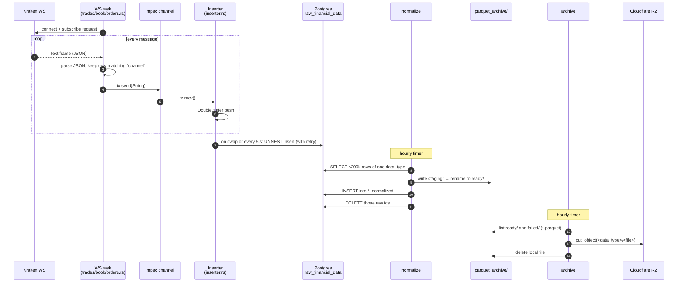
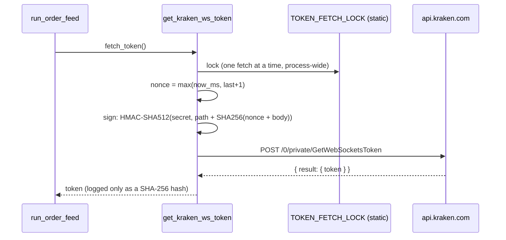
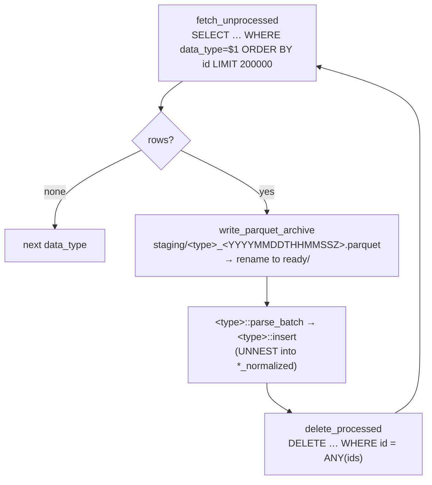
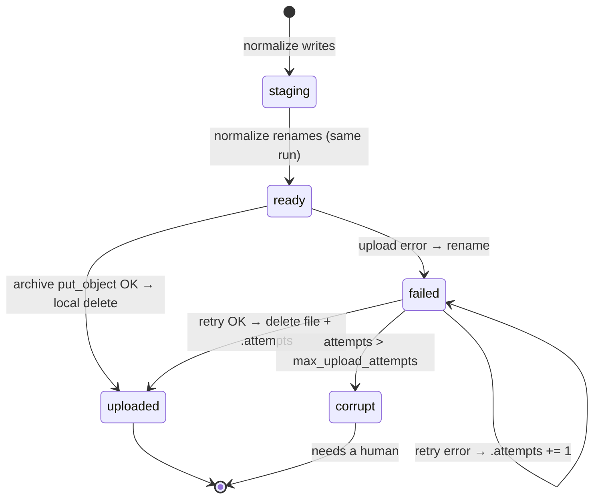

# Data Lifecycle: One Message, End to End

This follows a single Kraken message from the socket to Cloudflare R2. Each stage lists
what the data **looks like** there, the **code** that touches it, and what can go
**wrong**. The [loss & duplication table](#where-data-can-be-lost-or-duplicated) at the
bottom collects every failure point in one place.



---

## Stage 1 · Subscribe

**Code:** `run_trade_feed` / `run_book_feed` / `run_order_feed` in
[src/data_feeds/kraken/feeds/](../src/data_feeds/kraken/feeds/), via `kraken_connect` in
[connector.rs](../src/data_feeds/kraken/connection/connector.rs).

Each pipeline opens **its own** WebSocket and subscribes to **one symbol, one channel**:

| Feed type | URL | Subscribe params | Auth |
|---|---|---|---|
| trades | `wss://ws.kraken.com/v2` | `channel: "trade"`, `snapshot: false`, `req_id: 231` | none |
| book | `wss://ws.kraken.com/v2` | `channel: "book"`, `depth: 100`, `snapshot: true`, `req_id: 1234` | none |
| orders | `wss://ws-l3.kraken.com/v2` | `channel: "level3"`, `depth: 100`, `snapshot: false`, `token`, `req_id: 1234` | token from REST |

**Orders token flow** (before *every* connect):



⚠️ **Subscribe errors are invisible.** If Kraken rejects a subscription (bad symbol,
expired token), its reply has no matching `channel`, so the filter in stage 2 drops it.
What you see is a "No messages received in 60s" warning followed by a reconnect.

## Stage 2 · Receive and filter

**Code:** the inner `loop` of each feed function.

Every read is wrapped in `tokio::time::timeout(60s)` (`STALE_CONNECTION_TIMEOUT_SECS`).
Each frame is handled like this:

| Frame | Action |
|---|---|
| Text, JSON with matching `channel` (`trade` / `book` / `level3`) | `tx.send(msg)` |
| Text, anything else (heartbeat, status, subscribe ack, errors) | dropped silently |
| Ping / Pong / Binary | ignored (proves the connection is alive) |
| Close frame, stream end, read error, 60 s of silence | log, `break` → reconnect |
| `tx.send` fails (inserter gone) | log, **`return`**. The feed stops for good. |

**Data shape here:** `String`, the exact text Kraken sent. Example trade message:

```json
{"channel":"trade","type":"update","data":[{"symbol":"BTC/USD","side":"buy","qty":0.01,
 "price":62000.1,"ord_type":"market","trade_id":123,"timestamp":"2026-10-06T12:00:00.123456Z"}]}
```

Backpressure: the channel holds `buffer_capacity` messages. If it's full, `tx.send().await`
**waits**, so the WS task stops reading and Kraken eventually disconnects a slow reader.

## Stage 3 · Buffer

**Code:** `Inserter::push` in [inserter.rs](../src/db/inserter.rs) →
`DoubleBuffer::buffer_push_and_swap` in [buffer.rs](../src/db/buffer.rs).

The message goes into `active.messages: Vec<String>`. Provider, symbol and feed type get
(re)set on the buffer at the same time.

A **swap** happens when `active.len() >= floor(buffer_capacity × buffer_swap_trigger)`.
With the example config (100 × 0.8), that's every 80 messages. The full buffer is returned
to the inserter and a fresh empty one replaces it.

A **partial flush** (`DoubleBuffer::take_partial`) happens:
- every **5 s** (`FLUSH_INTERVAL` in [raw_feed.rs](../src/data_feeds/kraken/raw_feed.rs)),
- on **shutdown** (after draining whatever is still in the channel),
- when the **feed closes** (WS task returned, so the channel closed).

## Stage 4 · Write the raw rows

**Code:** `Inserter::write` → `RawRow::data_buff_to_rawrows`
([postgresql.rs](../src/db/postgresql.rs)) → `insert_with_retry` → `PostgresDBRaw::insert_raw_data_batch`.

1. Each `String` is parsed again into `serde_json::Value`, giving one `RawRow` per message.
   `received` = `Utc::now()` **at conversion time**, the same value for the whole batch.
2. One statement inserts the batch:
   `INSERT INTO raw_financial_data (...) SELECT * FROM UNNEST($1::timestamptz[], …, $5::jsonb[])`.
3. On failure it retries with backoff 1 s, 2 s, 4 s … capped at 30 s, for 8 attempts in
   total (`RetryPolicy::default()`). After that the batch is **dropped** with an `Error`
   in `system.log` and the inserter carries on with the next batch.

**Data shape in Postgres:**

| id | received | data_provider | data_type | symbol | raw_json |
|---|---|---|---|---|---|
| 1042 | 2026-10-06 12:00:05+00 | kraken | trades | BTC/USD | `{"channel":"trade",…}` |

## Stage 5 · Normalize (hourly)

**Code:** [src/normalizer/](../src/normalizer/), driven by `run_all` from `normalize`.

For each `data_type` **in this order: trades, book, orders**, it repeats `run_one_batch`
until a fetch returns nothing:



**Parquet schema** (all non-null): `id` Int64 (Int32 in files written before the bigint
migration), `received` Utf8 (RFC 3339), `data_provider`, `data_type`, `symbol`, `raw_json`
all Utf8. No compression is set.

**Raw → normalized field mapping:**

| Normalized column | trades | book | orders |
|---|---|---|---|
| `provider` | raw row `data_provider` | same | same |
| `symbol` | `data[].symbol` | `data[].symbol` | `data[].symbol` |
| `event_time` | `data[].timestamp` | `data[].timestamp` | `data[].timestamp` |
| `received` | raw row `received` | same | same |
| type-specific | `side`, `price`, `qty`, `trade_id` | `checksum`, `bids`, `asks` (JSON `[{price,qty}]`) | `checksum`, `bids`, `asks` (JSON `[{event?,order_id,limit_price,order_qty,timestamp}]`) |
| `provider_meta` | `{"ord_type": …}` | `{}` | `{}` |

One raw message holds a `data` **array**, and each element becomes its own normalized row.
⚠️ The top-level `type` (`snapshot`/`update`) is **not** carried over for book or orders.

## Stage 6 · Parquet file lifecycle

**Code:** `R2Archiver::archiver` in [src/archive/r2.rs](../src/archive/r2.rs).



- Each run processes **`failed/` first, then `ready/`**. Only `*.parquet` files count.
- R2 object key = `<prefix>/<filename>`, where `prefix` is the filename up to the first `_`
  (so `trades_20261006T120000Z.parquet` → `trades/trades_20261006T120000Z.parquet`).
- A file that fails from `ready/` gets its first sidecar on the **next** run. So "attempts"
  counts retries from `failed/`, not the first failure.

## Stage 7 · Backfill (manual)

**Code:** [src/bin/backfill.rs](../src/bin/backfill.rs).

It reads every `staging/<type>_*.parquet`, sorted by name, streams rows in chunks of
50 000, and runs the same `parse_batch` + `insert` as the normalizer. It does **not**
truncate the target table, so prepare that yourself first.

⚠️ **Backfill reads `staging/`, but files only pass through `staging/` for a moment.** In
normal operation `staging/` is empty, and archived files live in R2. To backfill, download
the files you want from R2 into `parquet_archive/staging/` first.

---

## Where data can be lost or duplicated

| # | Situation | Effect | Visible as |
|---|---|---|---|
| 1 | WS disconnect / reconnect gap | Messages during the gap are **lost** (Kraken has no replay). Book re-snapshots on reconnect; trades and orders don't. | `kraken.log`: "Stream ended" / "stale" / "read error" |
| 2 | Subscribe rejected | Nothing collected; reconnects every 60 s | repeated "No messages received in 60s" |
| 3 | Batch fails all 8 insert attempts | That batch is **lost**; pipeline continues | `system.log` Error "gave up inserting a batch" |
| 4 | Feed hits `max_reconnect_attempts` | That pipeline stops until restart; its buffer is flushed first | "Max Attempts reached" + "feed channel closed" |
| 5 | Daemon gets SIGTERM | Buffers flushed, nothing lost (unless flushing takes >30 s) | `system.log` "All DB inserters flushed" |
| 6 | Daemon crashes / SIGKILL / OOM | Up to one swap-threshold of messages + channel contents **lost** per pipeline | systemd journal |
| 7 | Normalizer crashes after Parquet write, before insert | Next run archives the same rows again → **duplicate Parquet** | two files with overlapping ids |
| 8 | Normalizer crashes after insert, before delete | **Duplicate normalized rows** + duplicate Parquet | duplicate `trade_id`s |
| 9 | One raw row fails to parse in `parse_batch` | The whole normalize run errors out. The row stays in raw, every later run fails on it, and the raw table **grows without bound**. A new duplicate Parquet copy of that chunk is written (and uploaded) every run. | `normalize` exit status ≠ 0 in journal |
| 10 | Two normalize batches of one type in the same second | Same Parquet filename → second file **overwrites** the first | missing ids in archive (only with >200k backlog) |
| 11 | Upload OK but local delete fails | Re-uploaded next run (same key, harmless overwrite) | `system.log` "failed to delete local copy" |
| 12 | `corrupt/` file | Never uploaded; still on disk | `system.log` "Moved to Corruped" |
