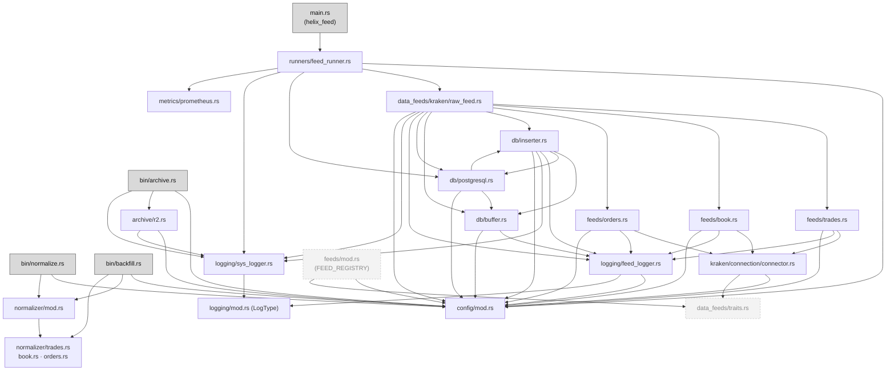

# Module Reference

Every source file: what it owns, what it **depends on**, and what **depends on it**. Use
the "Used by" column before changing a public item: everything listed there is what
might break.

## Dependency graph

Arrows mean "imports from". Grey boxes are entry points (binaries).

**What the graph tells you:**
- `config/mod.rs` is the **root**. It imports nothing internal, and almost everything
  imports it. Renaming a config struct or field ripples everywhere.
- The **normalizer imports nothing** from the daemon side (no `config::FeedType`, no `db`).
  It's coupled to the daemon **only through the database**, by string values. See
  [hidden couplings](#hidden-couplings-not-visible-in-imports).
- `db/inserter.rs` ↔ `db/postgresql.rs` import each other. `inserter` defines the
  `RawSink` trait, and `postgresql` implements it for `PostgresDBRaw` and supplies `RawRow`.

---

## Daemon (`helix_feed`)

### [src/main.rs](../src/main.rs)
Entry point. Loads `.env` (`dotenvy`), calls `feed_runner("helix_config.yml")`.
**Depends on:** `runners::feed_runner`.

### [src/runners/feed_runner.rs](../src/runners/feed_runner.rs)
Top-level orchestration of the daemon.

| Item | What it does |
|---|---|
| `feed_runner(path)` | metrics → load + validate config → one `PostgresDBRaw` → shutdown `watch` channel → per-provider setup → wait for signal → flush and join inserters |
| `wait_for_shutdown_signal()` | resolves on SIGINT (Ctrl-C) **or** SIGTERM (systemd stop) |
| `SHUTDOWN_FLUSH_TIMEOUT` | 30 s, the most time inserters get to flush on shutdown |

**Depends on:** config, `kraken_raw_feed_channel`, `PostgresDBRaw`, `SysLogger`, metrics.
**Used by:** `main.rs` only.
**Change here when:** adding a provider (the `match provider.provider.as_str()`), changing
startup or shutdown order.

### [src/data_feeds/kraken/raw_feed.rs](../src/data_feeds/kraken/raw_feed.rs)
Builds every Kraken pipeline. For each `SymbolConfig` it creates the channel, the
`FeedLogger`/`SysLogger` handles, spawns the WS task for that feed type, and spawns the
`Inserter`. Returns the inserters' `JoinHandle`s.

| Item | Notes |
|---|---|
| `kraken_raw_feed_channel(provider_conf, log_conf, db, buffer_capacity, buffer_trigger, shutdown)` | Fails only on setup (a log file can't be opened). Already-spawned pipelines keep running if a later one fails. |
| `FLUSH_INTERVAL` | 5 s partial-buffer flush |

**Depends on:** the three feed functions, `Inserter`, `RetryPolicy`, `DoubleBuffer`, `PostgresDBRaw`, loggers, config.
**Used by:** `feed_runner`.
**Change here when:** adding a feed type, changing per-pipeline wiring, or moving a
constant into config.

### [src/data_feeds/kraken/feeds/trades.rs](../src/data_feeds/kraken/feeds/trades.rs) · [book.rs](../src/data_feeds/kraken/feeds/book.rs) · [orders.rs](../src/data_feeds/kraken/feeds/orders.rs)
The WS tasks. All three have the same shape: a public `kraken_*_data_feed` wrapper that
calls `run_*_feed(url, …)`. The URL is a parameter so tests can point it at a fake
server. Each one runs an outer **reconnect loop** around an inner **read loop**.

| | trades | book | orders |
|---|---|---|---|
| Public fn | `kraken_trade_data_feed` | `kraken_book_data_feed` | `kraken_order_data_feed` |
| Testable fn | `run_trade_feed(url, …)` | `run_book_feed(url, …)` | `run_order_feed(url, fetch_token, …)` |
| Filters on `channel ==` | `"trade"` | `"book"` | `CHANNEL_ORDERS_L3` (`"level3"`) |
| Extra | — | `BookDepth` enum (depth 100) | fresh token **every** connect; token failure counts as a reconnect attempt; `OrderDepth` enum |

`attempts` resets to 0 on every successful connect, so `max_reconnect_attempts` means
*consecutive* failures.
**Depends on:** `connector` (URLs, channel names, `kraken_connect`, `STALE_CONNECTION_TIMEOUT_SECS`, `get_kraken_ws_token`), `FeedLogger`.
**Used by:** `raw_feed.rs`.
The `Kraken*Res*` structs in these files are **unused** (see [dead code](#dead--unused-code)).

### [src/data_feeds/kraken/connection/connector.rs](../src/data_feeds/kraken/connection/connector.rs)
Kraken networking primitives.

| Item | Notes |
|---|---|
| `KRAKEN_PUB_URL`, `KRAKEN_AUTH_URL` | public vs L3 endpoints |
| `CHANNEL_TRADES`, `CHANNEL_BOOK_L2`, `CHANNEL_ORDERS_L3` | subscribe channel names (`trade`, `book`, `level3`) |
| `STALE_CONNECTION_TIMEOUT_SECS` | 60, shared by all three feeds |
| `kraken_connect(req, url)` | connect, send the subscribe JSON, return the **read half only** (the write half is dropped) |
| `get_kraken_ws_token()` | REST call, HMAC-SHA512 signed. Reads `KRAKEN_API_KEY` and `KRAKEN_API_PRIVATE_KEY` from the env **at call time**. |
| `LAST_NONCE`, `TOKEN_FETCH_LOCK` | process-wide statics that keep nonces strictly increasing and token requests serialized |
| `KrakenConnector` + `impl DataProvider` | unused, a placeholder for M4 |

⚠️ Dropping the write half means the client can never answer pings or unsubscribe.
Tungstenite answers pings automatically only while the stream is being polled, which it
is, inside the read loop.

### [src/db/inserter.rs](../src/db/inserter.rs)
The per-pipeline DB writer.

| Item | Notes |
|---|---|
| `trait RawSink` | `insert_batch(&[RawRow])`. Implemented by `PostgresDBRaw` and by `FakeSink` in tests. |
| `RetryPolicy` (+ `Default`: 8 attempts, 1 s → 30 s) | backoff for a failed batch |
| `insert_with_retry(sink, rows, policy, sys_log, label)` | returns the last error once attempts run out |
| `Inserter<S>` | owns the `DoubleBuffer`, loggers, flush interval, retry policy |
| `Inserter::run(rx, shutdown)` | `tokio::select!` over shutdown, `rx.recv()`, and a flush ticker (see [runtime.md](runtime.md#the-inserter-select-loop)) |

**Used by:** `raw_feed.rs`; `postgresql.rs` (for the trait).

### [src/db/buffer.rs](../src/db/buffer.rs)
`DataBuffer` (a `Vec<String>` plus provider/symbol/feed_type tags and the swap threshold)
and `DoubleBuffer` (active + standby behind a `std::sync::Mutex`).

| Item | Notes |
|---|---|
| `buffer_push_and_swap(msg, provider, symbol_conf, logger, ctx)` | push; on threshold, return the full buffer and log "Buffer swap triggered" |
| `take_partial()` | return the active buffer if non-empty (timer/shutdown flush) |
| `get_messages()` | ⚠️ **clones** the whole Vec, every call |

The mutex is never contended: only the inserter task touches the buffer.
**Used by:** `inserter.rs`, `raw_feed.rs`, `postgresql.rs` (`DataBuffer` → `RawRow`).

### [src/db/postgresql.rs](../src/db/postgresql.rs)
| Item | Notes |
|---|---|
| `RawRow` | one row of `raw_financial_data` before insert |
| `RawRow::data_buff_to_rawrows(DataBuffer)` | parses each message to JSON; `received = Utc::now()` once per batch |
| `PostgresDBRaw::new(&PostgresConfig)` | `PgPool`, max 20 connections, URL built with `format!` (⚠️ password isn't URL-escaped) |
| `PostgresDBRaw::new_with_migration` | same, then runs `sqlx::migrate!("./migrations")`. **Only tests call this.** The daemon doesn't run migrations. |
| `insert_raw_data_batch(&[RawRow])` | one `INSERT … SELECT * FROM UNNEST(…)` |
| `impl RawSink for PostgresDBRaw` | adapter for the inserter |

### [src/metrics/prometheus.rs](../src/metrics/prometheus.rs)
Static `REGISTRY` plus five metrics (`helix_feeds_running`, `helix_messages_total`,
`helix_buffer_swaps_total`, `helix_reconnect_attempts_total`, `helix_feed_up`).
`start_metrics_server()` serves them on `0.0.0.0:9091`, any path.
⚠️ Nothing updates these metrics. The `TODO(v1.1.0 metrics)` comments mark where each
one belongs. ⚠️ `register_metrics()` panics if called twice, and the server panics if
port 9091 is already taken.

### [src/logging/](../src/logging/)
| File | Item | Notes |
|---|---|---|
| `mod.rs` | `LogType` | `Debug` / `Error` / `Info` / `Warn` |
| `feed_logger.rs` | `FeedLogger`, `LoggerContext` | line format `[ts] [LEVEL] \| provider \| symbol \| FeedType \| msg`; flushes every line |
| `sys_logger.rs` | `SysLogger` | line format `[ts] [LEVEL] \| system \| msg` |

Both open the file in append mode at construction. Many handles write to the same file.
Timestamps are **local time**, not UTC. Full catalogue in [logging.md](logging.md).

### [src/config/mod.rs](../src/config/mod.rs)
All config structs, `load_config(path)`, and `validate_config(&Config)`. Field-by-field
reference in [configuration.md](configuration.md).
`FeedType::as_str()` produces the `data_type` strings stored in the DB. **Don't change
them** without a data migration (see [hidden couplings](#hidden-couplings-not-visible-in-imports)).

---

## Batch jobs

### [src/bin/normalize.rs](../src/bin/normalize.rs) → [src/normalizer/mod.rs](../src/normalizer/mod.rs)
`normalize` builds its own pool (max 5), then calls `run_all`.

| Item | Notes |
|---|---|
| `PARQUET_ARCHIVE_STAGE`, `PARQUET_ARCHIVE_READY` | `parquet_archive/staging`, `parquet_archive/ready` (relative to CWD) |
| `FETCH_BATCH_SIZE` | 200 000 raw rows per chunk |
| `RawRecord` | one fetched raw row (`id: i64`) |
| `fetch_unprocessed`, `delete_processed` | raw-table read and delete by exact ids |
| `write_parquet_archive` (private) | staging → rename to ready |
| `read_archive_id(&ParquetRow)` | reads `id` as INT64 or legacy INT32 |
| `run_one_batch` / `run_for_data_type` / `run_all` | archive → parse → insert → delete, looping until empty |

### [src/normalizer/trades.rs](../src/normalizer/trades.rs) · [book.rs](../src/normalizer/book.rs) · [orders.rs](../src/normalizer/orders.rs)
Each has the same three parts: a `Normalized*` struct, `parse_batch(&[RawRecord])` (serde
envelope → rows), and `insert(pool, rows)` (UNNEST). The `Raw*` structs in these files are
the **actual** schema of Kraken's payloads as HelixFeed relies on them.
**Used by:** `normalizer/mod.rs`, `bin/backfill.rs`.

### [src/bin/backfill.rs](../src/bin/backfill.rs)
CLI `backfill <trades|book|orders>`. It reads `staging/<type>_*.parquet` in chunks of
50 000 and calls `<type>::parse_batch` + `insert`.

### [src/bin/archive.rs](../src/bin/archive.rs) → [src/archive/r2.rs](../src/archive/r2.rs)
`archive` exits early if `database_conf.r2` is missing. It creates `failed/` and
`corrupt/`, then runs `R2Archiver::archiver()`.

| Item | Notes |
|---|---|
| `PARQUET_ARCHIVE_READY` / `_FAILD` / `_CORRUPT` | folder constants (`FAILD` spelling is real) |
| `R2Archiver::new` | S3 client, region `auto`, endpoint from config, creds from `R2_API_ACCESS_KEY` / `R2_API_SECRET_KEY` |
| `list_parquet_files(dir)` | `*.parquet` only (skips `.attempts` sidecars) |
| `get_file_prefix(path)` | filename up to the first `_`, used as the R2 "folder" |
| `log_failed(name)` | read-increment-write the `.attempts` sidecar |
| `corrupt_clean_up` | moves the file to `corrupt/` once attempts exceed `max_upload_attempts` |
| `r2_archiver(path, folder)` | one `put_object` |
| `archiver()` | `failed/` pass, then `ready/` pass |

[src/archive/Docs/archiver_flow.mmd](../src/archive/Docs/archiver_flow.mmd) is the
original **design sketch**. It differs from the code: the code reads `ready/`, not a
"staging" folder, and the first failure only moves the file. The code is right.

---

## Hidden couplings (not visible in imports)

These pieces must agree, but the compiler won't tell you when they don't:

| What must match | Where | What breaks |
|---|---|---|
| `data_type` strings `"trades"`, `"book"`, `"orders"` | written: `FeedType::as_str()` (config). Read: `run_all`'s list and `run_one_batch`'s `match` (normalizer), `backfill` arg check | Rename one side → normalizer never picks up those rows, so raw grows forever |
| Parquet filename format `<data_type>_<ts>.parquet` | `archive_path` (normalizer) | archiver's `get_file_prefix` (R2 folder), backfill's `starts_with("<type>_")` filter |
| `"parquet_archive/ready"` | **defined twice**: `normalizer::PARQUET_ARCHIVE_READY` and `archive::r2::PARQUET_ARCHIVE_READY` | Change one → normalizer writes where archiver never looks |
| Parquet column order (id, received, provider, data_type, symbol, raw_json) | `write_parquet_archive` | `backfill` reads by **index** 0–5 |
| Kraken JSON field names | `normalizer/*.rs` `Raw*` structs | Kraken renames a field → `parse_batch` errors → normalize run fails (see [data-lifecycle.md #9](data-lifecycle.md#where-data-can-be-lost-or-duplicated)) |
| `raw_financial_data` columns | `insert_raw_data_batch` (daemon), `fetch_unprocessed` (normalizer), migrations | both binaries need updating together |
| Working directory | every binary opens `helix_config.yml`, `parquet_archive/…` and log paths relative to CWD | run from the wrong dir → "file not found" or files in odd places |
| Env var names | `connector.rs`, `r2.rs` | see [configuration.md](configuration.md#environment-variables) |

## Dead / unused code

It compiles and is public, but nothing calls it. Safe to ignore while tracing behaviour.

| Item | File | Note |
|---|---|---|
| `DataProvider`, `TickFeed`, `TradeFeed`, `BookFeed`, `OrdersFeed`, `ReplayCapability`, `NormalizedMessage` | `data_feeds/traits.rs` | M4 scaffolding |
| `KrakenConnector` + its `DataProvider` impl | `connector.rs` | M4 scaffolding |
| `FEED_REGISTRY`, `FeedRegistry`, `replay_capability()` | `feeds/mod.rs` | never registered or read |
| `create_logger()` | `kraken/mod.rs` | never called |
| `Kraken*Res*` / `Kraken*BidAsk` / `KrakenBookObject` structs | `feeds/*.rs` | response structs; the normalizer has its own |
| `Market` enum values | `config/mod.rs` | parsed, never read (TODO there about a `market` column) |
| `R2Config.upload_schedule` | config | validated, never used; the systemd timer decides the schedule |
| `bincode`, `simd-json` crates | `Cargo.toml` | no imports |
| All five Prometheus metrics | `prometheus.rs` | registered, never updated |
