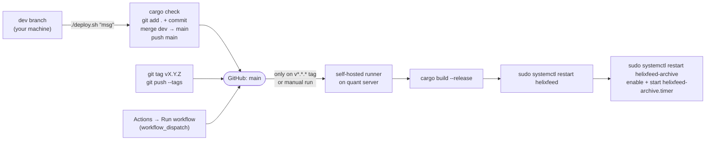

# Operations

Deploying, running, and debugging HelixFeed on the quant server.

## Deploy pipeline



⚠️ **Pushing to `main` does not deploy.** [.github/workflows/deploy.yml](../.github/workflows/deploy.yml)
triggers only on a `v*.*.*` **tag** or a manual run. `deploy.sh` pushes `main` but doesn't
tag, so after it you still have to tag (or click "Run workflow") for the server to build.

⚠️ `deploy.sh` runs `git add .`, which commits **everything** not git-ignored. Check
`git status` first. Only `.env`, `helix_config.yml`, `/logs`, `/target` and
`/parquet_archive` are ignored.

The workflow checks out with `clean: false`, so git-ignored folders in the runner's
workspace (`logs/`, `parquet_archive/`) survive a deploy (commit `94678a3`).

The workflow **doesn't** run tests, apply migrations, or touch the normalize timer.

## Server layout

| Path | What |
|---|---|
| `~/actions-runner/_work/HelixFeed/HelixFeed/` | the checkout = **working directory** for every service |
| `…/target/release/{helix_feed,normalize,archive,backfill}` | binaries |
| `…/helix_config.yml` | **symlink** → `~/secrets/helix_config.yml`, recreated by `ExecStartPre` |
| `…/logs/kraken.log`, `…/logs/system.log` | logs (paths from config) |
| `…/parquet_archive/{staging,ready,failed,corrupt}/` | archive pipeline |
| `~/secrets/helixfeed.env` | `EnvironmentFile` (Kraken + R2 keys) |
| `~/secrets/helix_config.yml` | real config |

## systemd units

Templates live in [deploy/](../deploy/). The `REPLACE_WITH_USER` and `REPLACE_WITH_PATH`
placeholders are filled in by hand when installing into `/etc/systemd/system/`.

| Unit | Type | Runs | Schedule | Notes |
|---|---|---|---|---|
| `helixfeed.service` | simple | `helix_feed` | always; `Restart=on-failure`, 5 s | `After=postgresql.service`; creates the config symlink |
| `helixfeed-normalize.service` | oneshot | `normalize` | via timer | creates the config symlink |
| `helixfeed-normalize.timer` | timer | — | `hourly`, `Persistent=true` | ⚠️ not enabled by CI; enable it once by hand |
| `helixfeed-archive.service` | oneshot | `archive` | via timer | ⚠️ no `ExecStartPre` symlink, so it relies on the others having created it |
| `helixfeed-archive.timer` | timer | — | `hourly`, `Persistent=true` | enabled by CI |

`systemctl stop`/`restart helixfeed` sends **SIGTERM**. The daemon flushes every buffer
(up to 30 s) before exiting. Keep `TimeoutStopSec` at its default (90 s) or higher.

After editing a unit file:

```bash
sudo systemctl daemon-reload
```

## Everyday commands

```bash
systemctl status helixfeed
```

```bash
journalctl -u helixfeed -f
```

```bash
systemctl list-timers 'helixfeed-*'
```

```bash
sudo systemctl start helixfeed-normalize.service
```

```bash
journalctl -u helixfeed-normalize --since today
```

## Logs

| File | Written by | Contents |
|---|---|---|
| `logs/kraken.log` | `FeedLogger` (daemon) | per-pipeline lifecycle: start, connect, reconnect, stale, buffer swaps |
| `logs/system.log` | `SysLogger` (daemon + archive) | inserter retries and drops, provider setup, shutdown, R2 uploads |
| systemd journal | stdout/stderr of every unit | panics, `println!` from normalize/backfill, startup errors |

Every log line has the form `[local time] [LEVEL] | …`. Grep one pipeline with:

```bash
grep "BTC/USD | Book" logs/kraken.log | tail
```

⚠️ No rotation. Add a logrotate rule with `copytruncate` (the loggers keep the file open):

```
/home/dakotah/actions-runner/_work/HelixFeed/HelixFeed/logs/*.log {
    weekly
    rotate 8
    compress
    missingok
    copytruncate
}
```

What each log line means: [logging.md](logging.md).

## Metrics

`curl localhost:9091/metrics` serves the Prometheus text format. ⚠️ Every value is 0 today
(not wired yet). The port listens on all interfaces, so firewall it or change the bind to
`127.0.0.1` if the server is reachable from outside.

## Runbook

| Symptom | Check | Likely cause → fix |
|---|---|---|
| No new rows for a symbol | `grep "<SYM> \| <Type>" logs/kraken.log \| tail` | reconnect loop, max attempts reached, or subscribe rejected (repeated "No messages in 60s") |
| "Max Attempts reached" in kraken.log | the error lines just above it | network/DNS, Kraken outage. Restart the service once it's resolved. |
| Orders: "WS token could not be retrieved" | the error text | env vars missing/wrong, key lacks WebSocket permission, nonce error (another process using the same key) |
| system.log: "insert … failed (attempt n of 8)" | `systemctl status postgresql`, disk space | Postgres down or full; recovers by itself once PG is back |
| system.log: "gave up inserting a batch" | the error text | lasting PG problem (data **lost** for that batch), or a schema mismatch after a bad migration |
| `raw_financial_data` keeps growing | `journalctl -u helixfeed-normalize` | normalizer failing every run, often a parse error on one row (see [data-lifecycle.md #9](data-lifecycle.md#where-data-can-be-lost-or-duplicated)) |
| Files piling up in `parquet_archive/failed/` | `grep R2 logs/system.log` | R2 credentials, endpoint, or network |
| Files in `parquet_archive/corrupt/` | the `.parquet` itself | exceeded `max_upload_attempts`; upload by hand once the cause is fixed |
| Service won't start | `journalctl -u helixfeed -n 50` | bad config (validation message), PG unreachable at startup, log directory missing |
| `nextval: reached maximum value` | `SELECT last_value FROM raw_financial_data_id_seq` | the bigint migration hasn't been applied |

## Release checklist

1. `cargo test` passes locally (see [testing.md](testing.md)).
2. New migration? Apply it on the server **before** the new binaries run.
3. `./deploy.sh "message"`, then `git tag vX.Y.Z && git push origin vX.Y.Z` (bump
   `Cargo.toml` `version` to match).
4. Watch the Actions run. Then on the server: `systemctl status helixfeed`, and
   `tail logs/kraken.log` shows "Connected" for every pipeline.
5. After the next hour: `journalctl -u helixfeed-normalize` shows a clean run.
