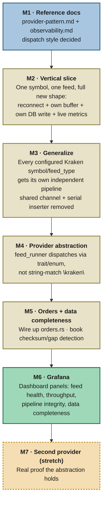

# HelixFeed Roadmap

The guiding principle: build the target pipeline shape (see [architecture.md](architecture.md)) **once, correctly, on a single symbol**, before spreading it out to every symbol and every provider. Each milestone below ends in something that runs and something you can point at as "this works now" — not a half-finished rewrite blocking the next thing.

---

### M1 — Reference docs (no code)
**Goal:** `provider-pattern.md` (static vs. dynamic dispatch, both sketched) and `observability.md` (which metrics, which labels, the checksum/gap design) written and dispatch style decided.
**Why first:** everything after this points back to these two files whenever you lose the thread mid-build.

### M2 — Vertical slice: one symbol, full new shape
**Goal:** Just BTC/USD trades, just Kraken. A WS connection with real reconnect/backoff → its own `DoubleBuffer` → its own inserter task holding a `pool.clone()` → the metrics that task should emit (`feed_up`, `helix_messages_total`, `helix_buffer_swaps_total`) as live, labeled calls instead of the dead registrations sitting there today.
**Concepts:** `Arc`/`Clone` semantics for a shared `PgPool`, task-owned error handling (a task's failure shouldn't take the process down), a proper reconnect loop, `CounterVec`/`GaugeVec` with labels.
**Why this size:** hardest milestone conceptually, smallest in surface area — one symbol, fully proven, before it touches anything else.

### M3 — Generalize to every configured symbol/feed_type
**Goal:** Rip out the shared `mpsc` channel and the single serial inserter task in `feed_runner.rs`; replace with N independent copies of the M2 pattern, one per `symbol_feed` entry in config.
**Concepts:** avoiding copy-paste by extracting a small helper now that the pattern is proven; this is where the actual bottleneck dies.

### M4 — Lift it behind the provider abstraction
**Goal:** Wrap "spawn a symbol's independent pipeline" behind the trait/enum decided in M1. `feed_runner` iterates registered providers instead of `match provider.provider.as_str() { "kraken" => ... }`. Kraken is still the only implementor.
**Why not first:** designing the interface before M2/M3 prove the shape risks revising it once reality disagrees with the guess.

### M5 — Orders feed + book data-completeness
**Goal:** Wire the already-written `orders.rs` into the registry (it's built, just not connected). Add Kraken's checksum validation to `book.rs` so a dropped/out-of-order message becomes a counted, visible gap instead of silent book corruption.

### M6 — Grafana
**Goal:** Point Grafana at `:9091`, build panels for the four signal categories (feed health, throughput, pipeline integrity, data completeness) using metrics that already exist by now. Mostly not Rust — the payoff milestone after five rounds of plumbing.

### M7 — A real second provider (stretch)
**Goal:** Whichever exchange you actually want next, implemented against the M4 trait. The actual test of whether the abstraction was worth building.
