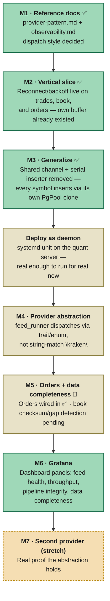

# HelixFeed Roadmap

The guiding principle: build the target pipeline shape (see [architecture.md](architecture.md)) **once, correctly, on a single symbol**, before spreading it out to every symbol and every provider. Each milestone below ends in something that runs and something you can point at as "this works now" — not a half-finished rewrite blocking the next thing.

---

### M1 — Reference docs (no code)
**Goal:** `provider-pattern.md` (static vs. dynamic dispatch, both sketched) and `observability.md` (which metrics, which labels, the checksum/gap design) written and dispatch style decided.
**Why first:** everything after this points back to these two files whenever you lose the thread mid-build.

### M2 — Vertical slice: one symbol, full new shape ✅ done
**Goal:** Real reconnect/backoff, built collaboratively on `trades.rs` first, then implemented independently on `book.rs` and `orders.rs` — each with its own retry loop, attempt counter, and backoff delay. Metrics (`feed_up`, `helix_messages_total`, etc.) still pending — folded into a later pass once M4/M6 are in view.
**Concepts learned:** reconnect loops as `loop { match { ... } }`, `Send` bounds and why a `MutexGuard` can't be held across an `.await`, cloning a request struct to work around single-ownership in a retry loop.
**Turned out simpler than planned:** since `raw_feed.rs` already loops per symbol, reconnect logic landed on every configured symbol automatically — M2 and M3's "generalize" step collapsed into one for this piece.

### M3 — Remove the shared DB bottleneck ✅ done
**Goal:** Ripped out the shared `mpsc` channel and the single serial inserter task in `feed_runner.rs` entirely. `kraken_raw_feed_channel` now takes a `PostgresDBRaw` directly, clones it once per symbol, and each symbol's buffer-swap task converts and inserts its own rows — no hand-off, no shared task.
**Concepts learned:** why cloning a `PgPool`-backed struct is cheap (it's an `Arc` underneath, not a new connection), `Send`-safety across `.await` again (hit the same `MutexGuard` issue in a new spot), handling nested `Result`s from a conversion step and a database call separately.

### Deploy as daemon
**Goal:** A `systemd` unit on the quant server (the existing self-hosted CI box) running the release binary, restarting on failure, starting on boot. Inserted here rather than at the end because M3 makes the pipeline genuinely usable — reconnect works, every symbol writes independently, nothing's placeholder. No reason to wait for M4–M7 to start collecting real data.

### M4 — Lift it behind the provider abstraction
**Goal:** Wrap "spawn a symbol's independent pipeline" behind the trait/enum decided in M1. `feed_runner` iterates registered providers instead of `match provider.provider.as_str() { "kraken" => ... }`. Kraken is still the only implementor.
**Why not first:** designing the interface before M2/M3 prove the shape risks revising it once reality disagrees with the guess.

### M5 — Orders feed + book data-completeness 🔶 half done
**Goal:** Wire the already-written `orders.rs` into the registry — ✅ done, along with reconnect/backoff for it. Still pending: Kraken's checksum validation on `book.rs` so a dropped/out-of-order message becomes a counted, visible gap instead of silent book corruption.

### M6 — Grafana
**Goal:** Point Grafana at `:9091`, build panels for the four signal categories (feed health, throughput, pipeline integrity, data completeness) using metrics that already exist by now. Mostly not Rust — the payoff milestone after five rounds of plumbing.

### M7 — A real second provider (stretch)
**Goal:** Whichever exchange you actually want next, implemented against the M4 trait. The actual test of whether the abstraction was worth building.
