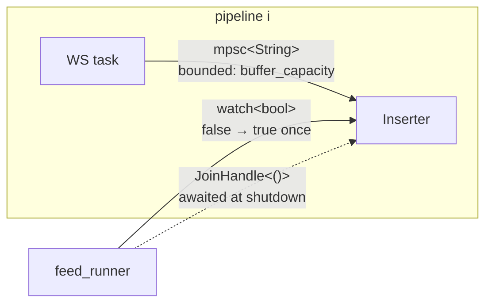
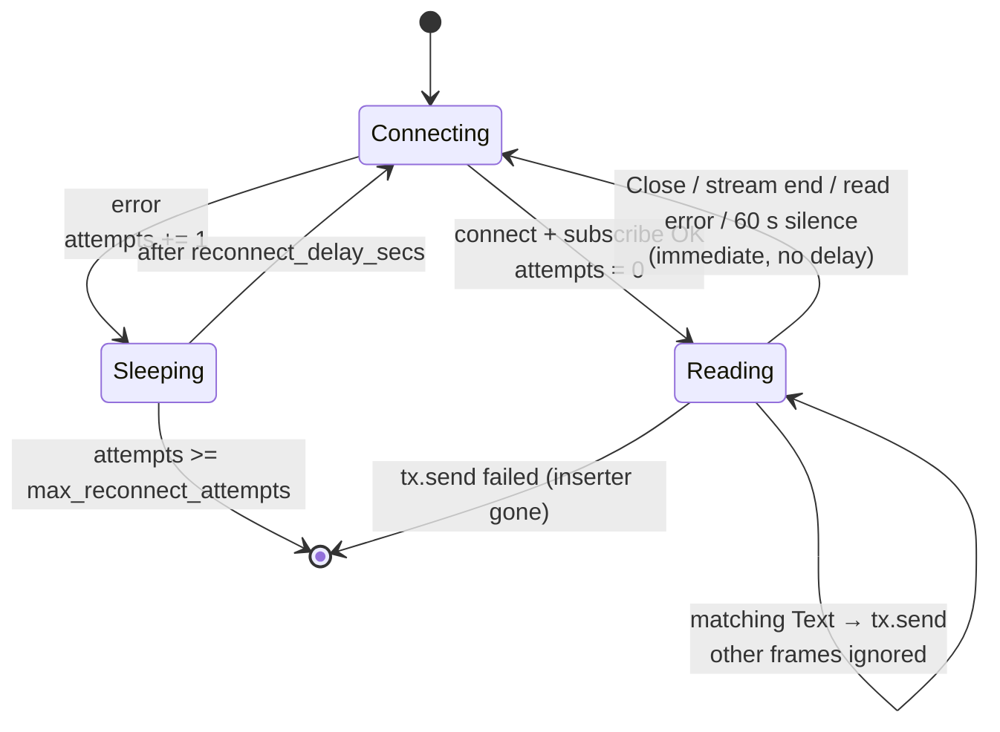
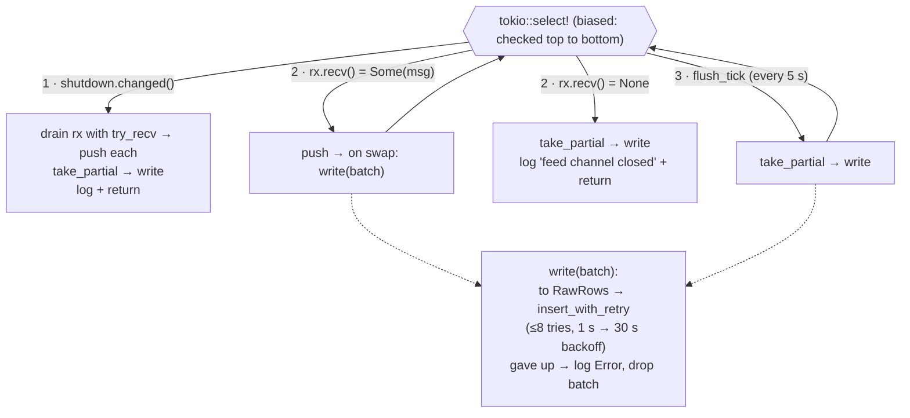
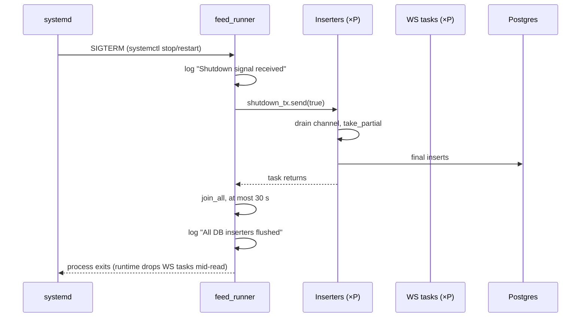

# Runtime: Tasks, Channels, Locks, Failure Behaviour

How the daemon actually behaves while it runs: what Tokio tasks exist, how they talk, what
they lock, how shutdown works, and what happens when each piece fails.

## Task inventory

With `P` pipelines (= number of `symbol_feeds` entries across all providers):

| Task | Count | Spawned in | Lives until |
|---|---|---|---|
| main / `feed_runner` | 1 | `#[tokio::main]` | shutdown signal + flush |
| metrics server accept loop | 1 | `feed_runner` | process exit (or panic) |
| metrics connection handler | 1 per HTTP connection | metrics server | that request ends |
| WS feed task | P | `raw_feed.rs` | `max_reconnect_attempts` consecutive failures, inserter gone, or process exit |
| Inserter task | P | `raw_feed.rs` | feed closes, or shutdown signal |

The runtime is multi-threaded (`tokio` "full" features, default worker count = CPU cores).

## Communication channels

| Channel | Type | Sender | Receiver | Closing it means |
|---|---|---|---|---|
| Feed channel | `mpsc::channel::<String>(buffer_capacity)` | WS task | Inserter | **Sender dropped** (WS task returned) → inserter flushes and exits. **Receiver dropped** (inserter exited) → WS task's next `send` fails, and it returns. |
| Shutdown | `watch::channel(false)` | `feed_runner` | every Inserter (cloned) | `send(true)` or sender dropped → inserters drain, flush, exit |

There is **no** channel from the inserter back to the WS task. The only way the inserter
can signal the feed is by dropping its receiver.

## Locks and shared state

| Lock / shared item | Kind | Held by | Held across `.await`? |
|---|---|---|---|
| `Arc<Mutex<FeedLogger>>` (one per pipeline) | `std::sync::Mutex` | WS task and inserter, only while writing a log line | **Never.** A std `MutexGuard` isn't `Send`, so holding it across an await won't compile inside `tokio::spawn`. Always lock in a `{ }` block. |
| `DoubleBuffer.inner_store` | `std::sync::Mutex` | Inserter only | never |
| `TOKEN_FETCH_LOCK` | `tokio::sync::Mutex<()>` (static) | `get_kraken_ws_token`, for the whole REST round-trip | **yes**, on purpose, which is why it's a tokio mutex |
| `LAST_NONCE` | `AtomicU64` (static) | CAS loop in `next_nonce()` | n/a |
| `PgPool` | internal `Arc`, max 20 connections | every inserter | a pool connection is held only during `execute` |
| `REGISTRY` and metrics | `lazy_static`, internally synchronized | metrics server | n/a |

`.lock().unwrap()` panics if the mutex is poisoned, which only happens if another holder
panicked while holding it. Today that would need a panic inside `feed_log` or
`buffer_push_and_swap`.

## The WS task loop

Orders adds a **token fetch** state before `Connecting`. A failed fetch goes to `Sleeping`
and counts as an attempt.

⚠️ Reconnecting from `Reading` has **no delay**, and the counter only grows when the
*connect itself* fails. A server that accepts the connection and then hangs up
immediately causes a tight reconnect loop.

## The inserter `select!` loop

From `Inserter::run` in [inserter.rs](../src/db/inserter.rs):

`biased;` makes the shutdown branch win whenever it's ready, so a busy feed can't starve it.

While `write` is retrying, the inserter **isn't reading the channel**. The channel fills,
the WS task blocks on `send`, and the socket stops being read. Worst case is about 1.5 min
per stuck batch, after which Kraken may drop the connection and the feed reconnects.

## Shutdown sequence

The WS tasks are never told to stop. They're cancelled when the runtime shuts down.
Anything Kraken sends between the flush and exit is lost, which is a few milliseconds.

## Failure behaviour matrix

| Fails | Immediate effect | Recovers? | Other pipelines affected? |
|---|---|---|---|
| Kraken connect (DNS, TLS, refused) | sleep `reconnect_delay_secs`, retry | yes, up to `max_reconnect_attempts` **consecutive** | no |
| Connection goes silent | 60 s timeout → reconnect | yes | no |
| Kraken rejects subscribe | looks like silence → reconnect every 60 s forever | only if the cause goes away | no |
| Orders token REST call | counts as an attempt, sleep, retry | yes, up to the max | no (but token fetches are serialized across all Orders pipelines) |
| Postgres down / slow | batch retried for about 1.5 min, then dropped; WS backs up | yes, automatically once PG is back | each pipeline retries on its own; they share the pool |
| A batch contains invalid JSON | batch dropped, logged | yes | no |
| Inserter task panics | receiver dropped → WS task returns | **no**, that pipeline is dead until restart | no |
| WS task panics | sender dropped → inserter flushes and exits | **no**, dead until restart | no |
| `FeedLogger`/`SysLogger` file can't be opened at startup | `kraken_raw_feed_channel` returns `Err`; pipelines spawned before it keep running | no | **yes**: later pipelines for that provider never start |
| Metrics port 9091 taken | metrics task panics | no | no (feeds unaffected) |
| `feed_runner` returns `Err` before the signal wait (bad config, PG unreachable at startup) | process exits non-zero | systemd `Restart=on-failure` after 5 s | everything restarts |
| SIGKILL / OOM / power loss | in-flight buffers lost | systemd restarts it | all |

⚠️ A pipeline that died (reached max attempts, or panicked) is only noticed through logs.
Nothing restarts a single pipeline: only a full service restart brings it back, and
`helix_feed_up` would show it if it were wired.
