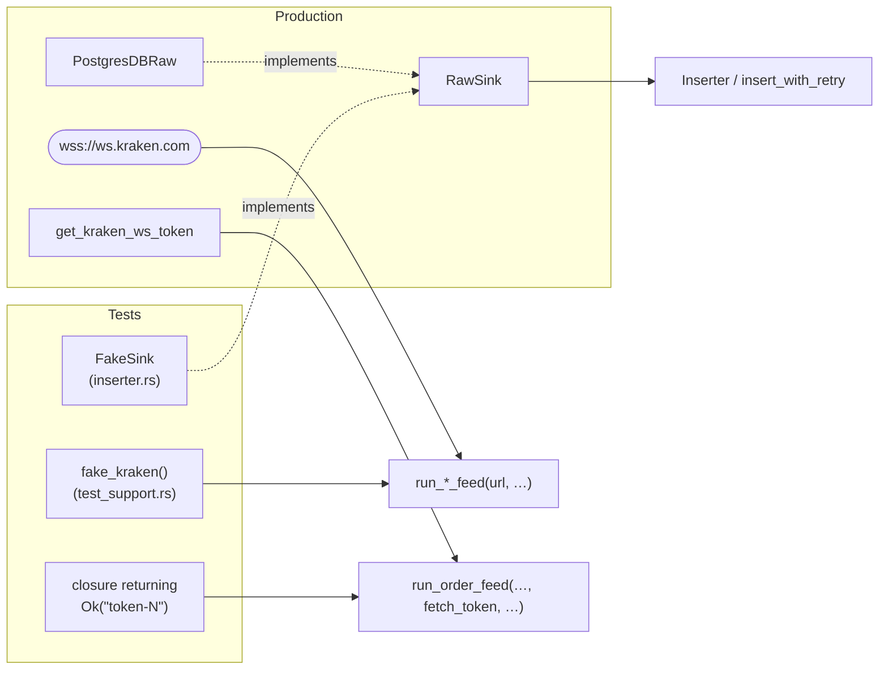

# Testing

```bash
cargo test
```

All tests are unit tests inside `src/` (`#[cfg(test)] mod tests`). There's no `tests/`
folder. Most tests run **fully offline**. Only the three Postgres tests need a database.

## Test inventory

| Area | Tests | Needs | What they protect |
|---|---|---|---|
| [config/mod.rs](../src/config/mod.rs) | 6 `test_*` | `DB_USER`/`DB_PASS` in `.env` (only to build a struct, no connection) | validation rules |
| [db/inserter.rs](../src/db/inserter.rs) | `retry_recovers_after_transient_failures`, `retry_gives_up_after_max_attempts`, `inserter_keeps_running_after_a_batch_fails`, `partial_buffer_is_flushed_on_interval`, `buffer_is_flushed_on_shutdown`, `buffer_is_flushed_when_feed_closes` | nothing | a DB failure never kills a pipeline; no data left in buffers on timer/shutdown/close |
| [feeds/trades.rs](../src/data_feeds/kraken/feeds/trades.rs) | `feed_stops_instead_of_reconnecting_when_receiver_is_dropped`, `feed_forwards_trade_messages_and_skips_others` | nothing (fake server) | no reconnect storm; channel filter |
| [feeds/book.rs](../src/data_feeds/kraken/feeds/book.rs) | `feed_stops_instead_of_reconnecting_when_receiver_is_dropped` | nothing | same |
| [feeds/orders.rs](../src/data_feeds/kraken/feeds/orders.rs) | `every_reconnect_uses_a_fresh_token`, `gives_up_after_max_token_failures` | nothing | stale-token bug; never connect without a token |
| [archive/r2.rs](../src/archive/r2.rs) | `list_parquet_files_skips_attempt_sidecars` | temp dir | `.attempts` files never uploaded |
| [normalizer/mod.rs](../src/normalizer/mod.rs) | `reads_new_int64_archive_ids_beyond_i32_range`, `reads_legacy_int32_archive_ids` | temp dir | backfill reads old and new archives |
| [db/postgresql.rs](../src/db/postgresql.rs) | `test_postgres_connection`, `test_postgres_with_migrations`, `test_insert_raw_data_batch` | **live Postgres** at `localhost:5432/helixfeed_dev` | pool connects; UNNEST column alignment |

Not covered yet: the normalizer `parse_batch` functions (good next target: feed them
captured real Kraken messages), `run_one_batch` end-to-end, the archiver upload path
(would need an S3 fake), `feed_runner` signal handling.

## Test helpers (fakes)



| Helper | File | Use it to |
|---|---|---|
| `FakeSink::failing(n)` | `db/inserter.rs` tests | an in-memory `RawSink` that fails the first `n` inserts, then stores batches. `stored_rows()` returns what landed. |
| `fast_retry(n)` | same | a `RetryPolicy` with ms delays so tests run quickly |
| `temp_log_path(name)` | same (`pub(crate)`) | a unique log file under the OS temp dir, so tests never write to `./logs` |
| `fake_kraken(replies, close_after)` | [kraken/test_support.rs](../src/data_feeds/kraken/test_support.rs) | a local WS server on a random port. Records each connection's subscribe request in `subscribes`, sends `replies`, then closes or stays open. |
| `test_logger(feed_type)` | same | a `FeedLogger` + `LoggerContext` pointed at a temp file |
| `eventually(cond)` | same | poll a condition for up to 2 s instead of a fixed sleep |

**Design rule that makes this testable:** anything that talks to the outside world takes
the dependency as a **parameter**: the URL (`run_*_feed(url, …)`), the token source
(`run_order_feed(…, fetch_token, …)`), and the database (`Inserter<S: RawSink>`). The
public `kraken_*_data_feed` wrappers pass the real ones. Follow this rule for new code.

## Postgres tests

They connect to `localhost:5432`, database `helixfeed_dev`, with `DB_USER`/`DB_PASS` from
`.env`. Note this is the **dev DB itself**: `test_insert_raw_data_batch` runs migrations
against it and inserts and deletes `symbol = 'TEST/UNIT'` rows.

### ⚠️ Known local failure: "relation raw_financial_data already exists"

The dev DB's `_sqlx_migrations` table only records the first two migrations, but
`raw_financial_data` already exists, so `sqlx::migrate!` tries to create it again. Fix it
once (you'll lose the dev DB's contents), as a Postgres superuser:

```bash
sudo -u postgres psql -c "DROP DATABASE helixfeed_dev;" -c "CREATE DATABASE helixfeed_dev OWNER <DB_USER>;"
```

Then `cargo test` recreates every table through the migrations, which also proves the
migrations run cleanly from scratch.

### Testing a migration without touching the dev DB

Run it against temp tables inside a transaction that rolls back (temp tables shadow the
real ones by name):

```bash
psql -h localhost -U "$DB_USER" -d helixfeed_dev -v ON_ERROR_STOP=1 <<'SQL'
BEGIN;
CREATE TEMP TABLE raw_financial_data (id SERIAL PRIMARY KEY, data_type TEXT);
CREATE TEMP TABLE trades_normalized (id SERIAL PRIMARY KEY);
CREATE TEMP TABLE book_normalized   (id SERIAL PRIMARY KEY);
CREATE TEMP TABLE orders_normalized (id SERIAL PRIMARY KEY);
\i migrations/20261006120000_bigint_ids.sql
SELECT pg_typeof(id) FROM raw_financial_data;
ROLLBACK;
SQL
```

Create a temp table for **every** table the migration touches. Any table you skip gets
altered for real (it's rolled back, but it still takes the lock while it runs).

## Writing a new test

- Pure logic → a plain `#[test]`.
- Anything async → `#[tokio::test]`.
- Anything that waits → wrap it in `tokio::time::timeout(…)` so a regression fails the
  test instead of hanging `cargo test`.
- A regression test should **fail on the old code**. Check by temporarily reverting the
  fix and running the test (that's how the reconnect-storm test was verified).

## Running a subset

```bash
cargo test --lib inserter
```

```bash
cargo test --lib feeds
```

```bash
cargo test --lib -- --nocapture
```
